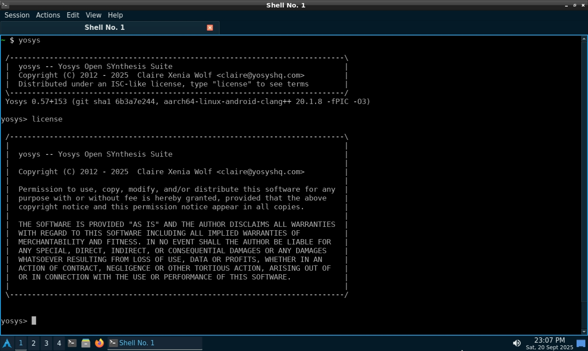
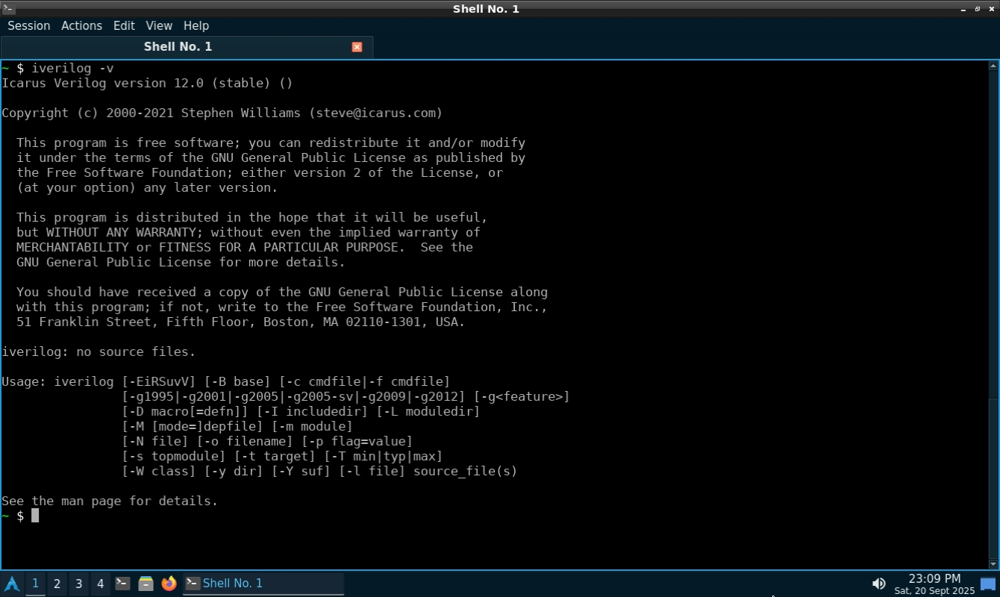
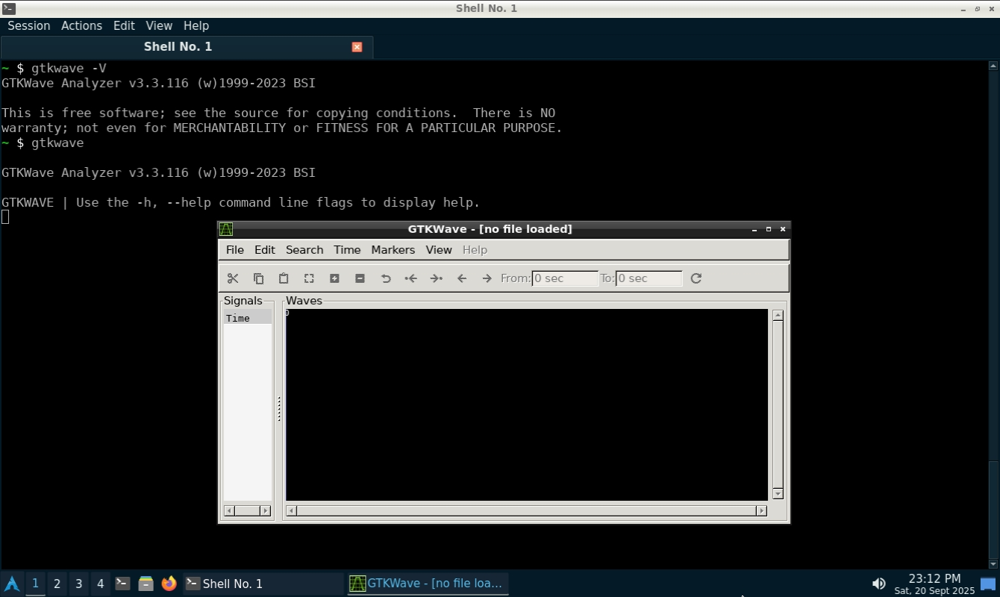

# 🛠 Week 0 – Environment Setup

This repository documents my **Week 0 progress** in the **VSD RISC-V SoC Tapeout Program**.  
In this week, the task was to install and verify all required **open-source VLSI tools**.

---

## 🖥 System Check

- 6GB RAM  
- 50 GB HDD  
- Ubuntu 20.04+  
- 4vCPU

---

## 📌 Tools Installed

| Tool | Purpose |  
|------|---------|  
| Icarus Verilog | Verilog Simulator |  
| GTKWave | Waveform Viewer |  
| Yosys | Logic Synthesis |  

---

## 🔗 Parent Repository
This Week 0 repo is part of my master hub: [RISC-V SoC Tapeout Journey](https://github.com/Avinash-gh/RISC-V_SoC_Tapeout_VSD)

---

## 📖 Installation Instructions  
### 1. Yosys - Logic Synthesis Tool  

```bash  
$ sudo apt-get update 
$ git clone https://github.com/YosysHQ/yosys.git 
$ cd yosys 
$ sudo apt install make (If make is not installed please install it) 
$ sudo apt-get install build-essential clang bison flex \ 
 libreadline-dev gawk tcl-dev libffi-dev git \ 
 graphviz xdot pkg-config python3 libboost-system-dev \ 
 libboost-python-dev libboost-filesystem-dev zlib1g-dev 
$ make config-gcc 
$ make 
$ sudo make install
```  
  

### 2. Icarus Verilog - Verilog Simulator  

```bash  
sudo apt-get install iverilog
```  


### 3. GTKWave - Waveform Viewer  

```bash  
$ sudo apt install gtkwave
```  
  

---

> ✅ Week 0 completed: Environment setup verified and tools ready for RISC-V SoC design.
